# Сингулярное разложение и сжатие изображений
[Репозиторий](https://github.com/ksenmel/svd-compress/tree/main) с реализацией утилиты. 

Программа, реализованная на языке Python, 
 производит сжатие изображения в формате .bmp (24 бита на цвет) с минимизацией потери качества при фиксированном ограничении на размер сжатого файла, используя сингулярное разложение (SVD)

## Аппаратное обеспечение
- Процессор — **Apple M2**
- Оперативная память — **8 GB**
- Операционная система — **macOS Ventura 13.0**

## Реализованные алгоритмы SVD
- [Numpy](https://numpy.org/doc/stable/reference/generated/numpy.linalg.svd.html)
- [Power-Iterations](http://www.cs.yale.edu/homes/el327/datamining2013aFiles/07_singular_value_decomposition.pdf)
- [Block-Power-Iterations](https://www.degruyter.com/document/doi/10.1515/jisys-2018-0034/html)

## Эксперимент

Были взяты следующие значения для степени сжатия: 2, 5, 10, 20, 50, 100. 
Ниже представлена таблица с полученными результатами для трех изображений. Все полученные изображения находятся в директории decompressed.
Используемая версия numpy - 1.26.4

| Method\Power           | 2                                       | 5                                        | 10                                       | 20                                       | 50                                       | 100                                       |
|------------------------|-----------------------------------------|------------------------------------------|------------------------------------------|------------------------------------------|------------------------------------------|-------------------------------------------|
| Numpy                  |     |      |     |     |     |     |
| Power-Iterations       |    |     |    |    |    |    |
| Block-Power-Iterations |  |   |  |  |  |  |

| Method\Power           | 2                                          | 5                                          | 10                                          | 20                                          | 50                                            | 100                                           |
|------------------------|--------------------------------------------|--------------------------------------------|---------------------------------------------|---------------------------------------------|-----------------------------------------------|-----------------------------------------------|
| Numpy                  | 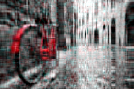    | 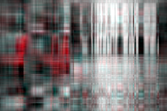    | 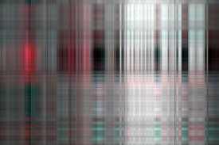    | 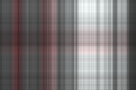    |       |      |
| Power-Iterations       | 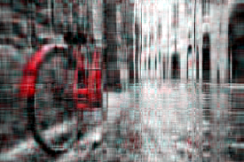   | 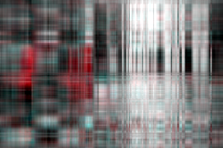   | 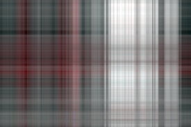   |    |      |     |
| Block-Power-Iterations |  |  |  |  |    |   |

| Method\Power           | 2                                         | 5                                         | 10                                         | 20                                         | 50                                         | 100                                         |
|------------------------|-------------------------------------------|-------------------------------------------|--------------------------------------------|--------------------------------------------|--------------------------------------------|---------------------------------------------|
| Numpy                  |     |     |     |     | 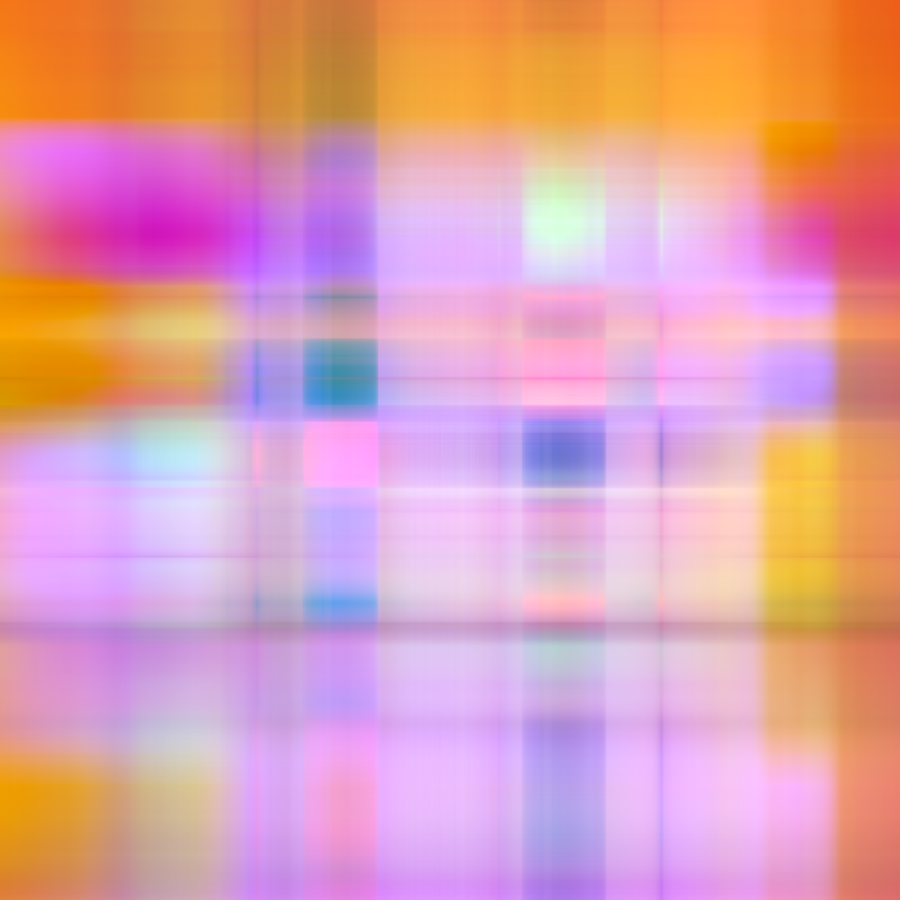    | 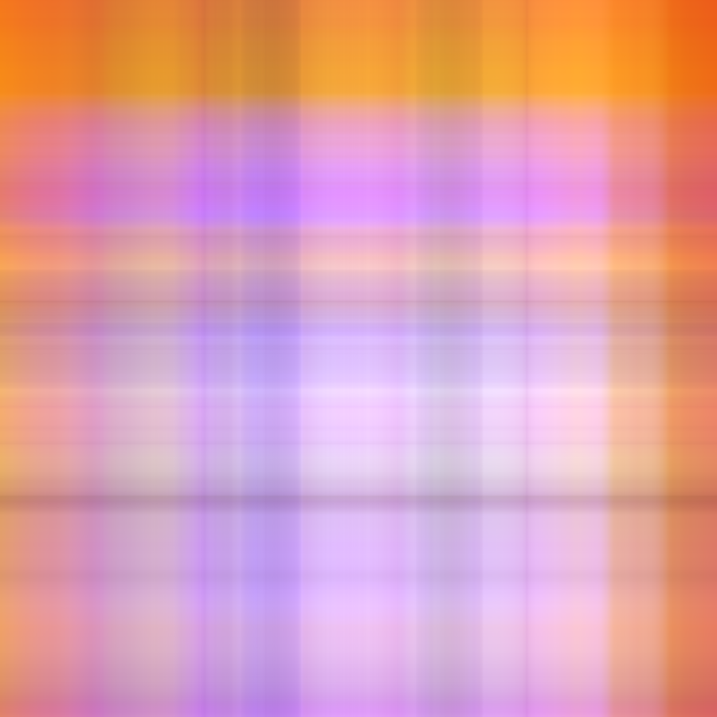    |
| Power-Iterations       |    |    |    |    | 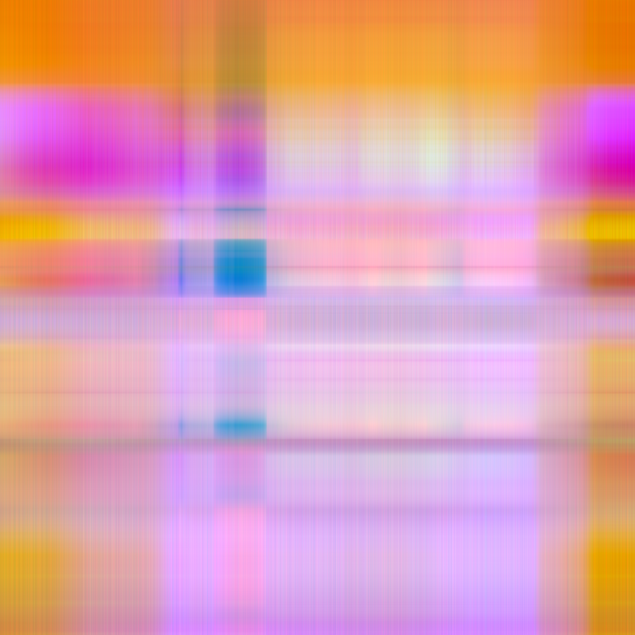   | 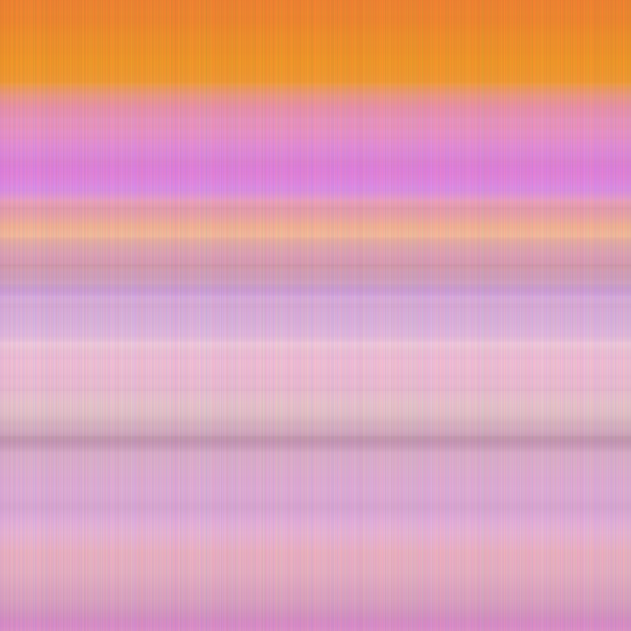   |
| Block-Power-Iterations |  |  |  |  |  |  |

## Выводы
Можно заметить, что не все изображения удалось сжать в 50 и 100 раз из-за недостаточного размера самих изображений. Как видно из таблицы метод из библиоткеи Numpy и Block-Power-Iterations дают схожие результаты для всех изображений вне зависимости от степени сжатия. 
Также, замерив скорость работы всех алгоритмов, numpy оказался на порядок быстрее, чем Power-Iterations и Block-Power-Iterations и при степени сжатия = 2  общее содержание изображения осталось узнаваемым. Алгоритм Block-Power-Iterations оказался практически эффективнее, чем Power-Iterations , так как он лучше подходит для работы с разреженными матрицами.